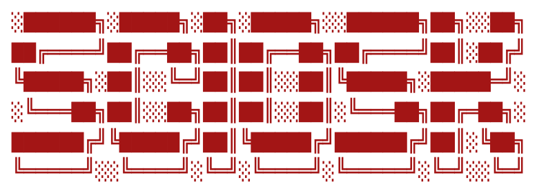

[](https://travis-ci.org/github/ksunisth/sciosk)
--
{Scio - Know (in Latin), sk - Sunisth Kumar}

## Quick Start
Package installation can be done with [`npm install` command](https://docs.npmjs.com/getting-started/installing-npm-packages-locally):
```
$ npm install -g sciosk
```

## Usage
Start the quiz using the following CLI command:
```
$ sciosk
```

## Local Use
```js
const sun = require('sciosk');

// Starts a quiz with 7 random questions about Sunisth
```

## Licsense
[MIT](LICENSE) © Sunisth Kumar
